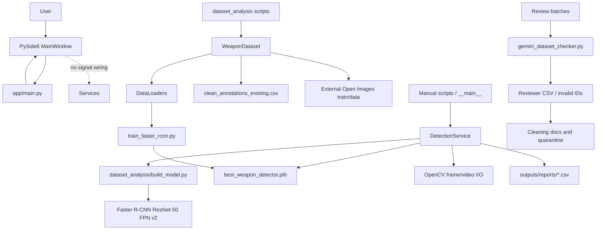
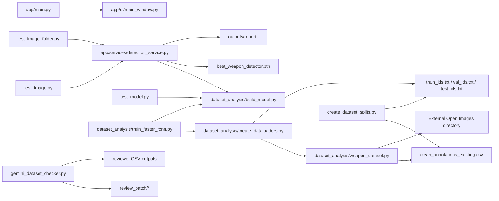

# CCTV Weapon Detection System: Complete Repository Inventory

## Scope and Status Rules

This inventory was produced from the workspace contents on 2026-08-20. `Complete` means the file contains a usable implementation or finished artifact for its stated role. `Partially implemented` means it contains a real but incomplete path. `Placeholder` means empty or explicitly planned. `Unused` means present but not reachable from the current application flow; a file can be both partially implemented and unused.

Binary images, videos, and the PyTorch checkpoint were inspected as filesystem artifacts, not decoded line-by-line. Homogeneous generated assets are inventoried by directory and filename pattern; their individual paths are represented by the directory listing rather than repeated data rows.

## Repository Snapshot

| Area | Contents | Assessment |
|---|---|---|
| `app/` | PySide6 shell, detection service, empty service/util modules | Detection engine is usable; desktop workflow is incomplete |
| `dataset_analysis/` | Open Images cleaning, dataset adapter, Faster R-CNN build/train scripts | Main working training path; scripts are path- and cwd-dependent |
| `training/` | Package with empty `config.py`, `dataset.py`, `train.py`, `evaluate.py` | Placeholder package; not the active training implementation |
| `samples/` | Test images and videos | Usable evaluation fixtures |
| `review_batch/`, `removed_images/` | Review and quarantine images | Dataset curation artifacts |
| `outputs/` | Detection CSV reports; empty enhanced-video directory | Generated evidence; enhancement is not implemented |
| `models/`, `data/`, `MAIN/`, `archive/` | Mostly empty/documentation-only directories | No active implementation found |

## File-by-File Inventory

### Root Source and Configuration Files

| File | Purpose | Classes | Functions | Key imports | Project dependencies | Status |
|---|---|---|---|---|---|---|
| `app/main.py` | Starts the PySide6 desktop application and shows `MainWindow` | None | `main` | `sys`, `PySide6.QtWidgets.QApplication` | `app.ui.main_window.MainWindow` | Partially implemented; UI is only constructed |
| `app/__init__.py` | Package marker | None | None | None | None | Complete |
| `app/ui/main_window.py` | Builds the main CCTV upload/analyze/results window | `MainWindow` | `__init__`, `create_interface` | PySide6 widgets/layouts | None currently; no service wiring | Partially implemented; buttons and fields have no signal handlers |
| `app/ui/__init__.py` | UI package marker | None | None | None | None | Complete |
| `app/ui/styles.qss` | Intended Qt stylesheet | None | None | None | None | Placeholder; empty and not loaded |
| `app/services/detection_service.py` | Loads Faster R-CNN, detects weapons in frames, annotates frames, scans/processes videos, writes CSV reports | `DetectionService` | `__init__`, `detect_frame`, `draw_detections`, `test_first_frame`, `scan_video_for_weapons`, `scan_video_for_knives`, `process_video` | `pathlib`, `sys`, `csv`, `cv2`, `torch` | `dataset_analysis.build_model.get_model`; `best_weapon_detector.pth`; OpenCV video/sample paths; `outputs/reports` | Complete standalone inference path; not connected to UI |
| `app/services/video_service.py` | Intended video metadata/reading/processing abstraction | None | None | None | None | Placeholder; empty |
| `app/services/report_service.py` | Intended report export/formatting abstraction | None | None | None | None | Placeholder; empty; report writing is duplicated in detection service |
| `app/services/video_enhancement_service.py` | Planned BasicVSR++/super-resolution integration | None | None | None | None | Placeholder; docstring only |
| `app/services/__init__.py` | Services package marker | None | None | None | None | Complete |
| `app/utils/file_validation.py` | Intended video/file validation helpers | None | None | None | None | Placeholder; empty |
| `app/utils/timestamps.py` | Intended timestamp formatting helpers | None | None | None | None | Placeholder; empty |
| `app/utils/__init__.py` | Utilities package marker | None | None | None | None | Complete |
| `count_available_images.py` | Downloads/loads Open Images Knife train/validation/test subsets and prints counts | None | None | `fiftyone.zoo` | FiftyOne/Open Images cache | Complete utility; unused by application |
| `count_available_images_handgun.py` | Downloads/loads Open Images Handgun subsets and prints counts | None | None | `fiftyone.zoo` | FiftyOne/Open Images cache | Complete utility; unused |
| `download_full_weapon_dataset.py` | Downloads Open Images train detections for Handgun and Knife | None | None | `fiftyone.zoo` | FiftyOne/Open Images | Complete utility; potentially duplicate of analysis download scripts; unused |
| `test_image.py` | Runs detector on `samples/test.jpg`, displays annotated result | None | None | `cv2`, app detection service | `samples/test.jpg` is absent from current sample listing | Partially implemented/broken fixture |
| `test_image_folder.py` | Runs detector over handgun, knife, and negative image folders | None | None | `pathlib`, `cv2`, app detection service | `samples/*_test_images`; model checkpoint | Complete script; manual smoke test, not test framework |
| `test_model.py` | Loads model architecture and checkpoint to verify compatibility | None | None | `torch`, `pathlib` | `dataset_analysis.build_model`, checkpoint | Complete smoke test; duplicated at root and not automated |
| `requirements.txt` | Main dependency lock/list | None | None | N/A | PyTorch/torchvision, OpenCV, PySide6 and related packages | Present but UTF-16 encoded; versions may be environment-specific |
| `requirements_before_basicvsr.txt` | Older dependency snapshot before BasicVSR work | None | None | N/A | Historical dependency set | Complete historical artifact; unused/currently superseded |
| `.gitignore` | Excludes environments, model weights, videos, datasets, and generated reports | None | None | None | Controls repository tracking | Complete but inconsistent with tracked/generated workspace artifacts |
| `best_weapon_detector.pth` | Trained Faster R-CNN state dictionary for background + handgun + knife classes | N/A | N/A | PyTorch binary | Consumed by `DetectionService` and `test_model.py` | Complete model artifact; binary not text-inspectable |
| `invalid_reviewer_b_handguns.csv` | Reviewer B invalid handgun IDs/results | N/A | N/A | CSV data | Dataset review artifacts | Complete data artifact; not imported by runtime code |
| `reviewer_b_handguns.csv` | Reviewer B handgun review results | N/A | N/A | CSV data | Dataset review artifacts | Complete data artifact; not imported by runtime code |

### `dataset_analysis/` Source Files

| File | Purpose | Classes | Functions | Key imports | Project dependencies | Status |
|---|---|---|---|---|---|---|
| `dataset_analysis/build_model.py` | Creates torchvision Faster R-CNN ResNet-50 FPN v2 and replaces predictor for 3 classes | None | `get_model` | `torchvision`, `FastRCNNPredictor` | Imported by training and app inference | Complete, but uses pretrained weights download/default behavior |
| `dataset_analysis/weapon_dataset.py` | Reads image IDs/CSV annotations, converts normalized boxes, maps Open Images labels to IDs, returns tensors | `WeaponDataset` | `__init__`, `__len__`, `_label_to_id`, `__getitem__` | `os`, `pandas`, `torch`, PIL, `Dataset` | `clean_annotations_existing.csv`; external Open Images image directory; split ID files | Partially implemented: constructor accepts transforms but never applies them; no validation for empty/invalid boxes |
| `dataset_analysis/create_dataloaders.py` | Instantiates train/validation/test datasets and DataLoaders; prints a sample batch | None | `collate_fn` | `DataLoader`, `WeaponDataset` | Requires missing `train_ids.txt`, `val_ids.txt`, `test_ids.txt`; external image root | Partially implemented/broken from a clean checkout |
| `dataset_analysis/create_dataset_splits.py` | Splits unique annotated image IDs 70/15/15 with seed 42 and writes ID files | None | None | `pandas`, `train_test_split` | `clean_annotations_existing.csv`; generates missing split files | Complete utility; cwd-dependent |
| `dataset_analysis/train_faster_rcnn.py` | Trains detector with SGD for 10 epochs and saves lowest training-loss checkpoint | None | None | `torch`, `torch.optim` | `create_dataloaders`, `build_model`; external dataset; writes root checkpoint | Partially implemented: no validation loss, metrics, checkpoint metadata, resume, or CLI; imports are script-relative |
| `dataset_analysis/test_dataset.py` | Manually loads first training sample and prints tensor/target details | None | None | `WeaponDataset` | `train_ids.txt`, annotations, external images | Complete smoke script once split/data paths exist |
| `dataset_analysis/gemini_dataset_checker.py` | Sends review-batch images to Gemini, parses category/status/reason, writes review CSV and invalid ID CSV | None | `build_client`, `collect_images`, `write_results`, `audit_folder`, `parse_args`, `main` | `argparse`, `csv`, `os`, `collections.Counter`, `pathlib`, PIL, `google.genai` | `GEMINI_API_KEY`; review batch directories; generated root CSVs | Partially implemented: `audit_folder` deliberately truncates to first image (`[:1]`); parser accepts unvalidated model output |
| `dataset_analysis/download_reviewer_b.py` | Downloads up to 200 Handgun and Knife train samples into named FiftyOne datasets | None | None | `fiftyone.zoo` | Network/FiftyOne cache | Complete utility; unused by runtime |
| `dataset_analysis/download_reviewer_c.py` | Downloads up to 300 Handgun and Knife samples | None | None | `fiftyone.zoo` | Network/FiftyOne cache | Complete utility; unused |
| `dataset_analysis/download_reviewer_d.py` | Downloads up to 400 Handgun and Knife samples | None | None | `fiftyone.zoo` | Network/FiftyOne cache | Complete utility; unused |
| `dataset_analysis/download_weapon_samples.py` | Downloads 50 Handgun and 50 Knife samples | None | None | `fiftyone.zoo` | Network/FiftyOne cache | Complete utility; unused |
| `dataset_analysis/train_faster_rcnn.py` | Active historical training script, distinct from empty `training/train.py` | None | top-level training loop | `torch`, optimizer, local analysis modules | Same as above | Partially implemented |
| `dataset_analysis/handgun_ids.txt` | Selected Handgun image IDs | N/A | N/A | Plain text IDs | Used as dataset curation input, no active code reference found | Complete data artifact; effectively unused by current loader |
| `dataset_analysis/knife_ids.txt` | Selected Knife image IDs | N/A | N/A | Plain text IDs | Dataset curation input | Complete data artifact; effectively unused |
| `dataset_analysis/invalid_all_ids.txt` | Combined invalid IDs | N/A | N/A | Plain text IDs | Dataset cleaning outputs | Complete data artifact; unused by runtime |
| `dataset_analysis/invalid_handgun_ids.txt` | Invalid handgun IDs | N/A | N/A | Plain text IDs | Dataset cleaning documentation | Complete data artifact; unused by runtime |
| `dataset_analysis/invalid_knife_ids.txt` | Invalid knife IDs | N/A | N/A | Plain text IDs | Dataset cleaning documentation | Complete data artifact; unused by runtime |
| `dataset_analysis/reviewer_a_handgun_ids.txt` | Reviewer A handgun IDs | N/A | N/A | Plain text IDs | Review workflow | Complete data artifact; unused by runtime |
| `dataset_analysis/reviewer_a_knife_ids.txt` | Reviewer A knife IDs | N/A | N/A | Plain text IDs | Review workflow | Complete data artifact; unused |
| `dataset_analysis/reviewer_a_reviewed_ids.txt` | Reviewer A reviewed IDs | N/A | N/A | Plain text IDs | Review workflow | Complete data artifact; unused |
| `dataset_analysis/reviewer_b_handgun_ids.txt` | Reviewer B handgun IDs | N/A | N/A | Plain text IDs | Review workflow | Complete data artifact; unused |
| `dataset_analysis/reviewer_b_knife_ids.txt` | Reviewer B knife IDs | N/A | N/A | Plain text IDs | Review workflow | Complete data artifact; unused |
| `dataset_analysis/reviewer_c_handgun_ids.txt` | Reviewer C handgun IDs | N/A | N/A | Plain text IDs | Review workflow | Complete data artifact; unused |
| `dataset_analysis/reviewer_c_knife_ids.txt` | Reviewer C knife IDs | N/A | N/A | Plain text IDs | Review workflow | Complete data artifact; unused |
| `dataset_analysis/reviewer_d_handgun_ids.txt` | Reviewer D handgun IDs | N/A | N/A | Plain text IDs | Review workflow | Complete data artifact; unused |
| `dataset_analysis/reviewer_d_knife_ids.txt` | Reviewer D knife IDs | N/A | N/A | Plain text IDs | Review workflow | Complete data artifact; unused |
| `dataset_analysis/clean_annotations.csv` | Cleaned annotation dataset | N/A | N/A | CSV data | Intended training input; current loader uses `clean_annotations_existing.csv` | Complete data artifact; unused by current loader |
| `dataset_analysis/clean_annotations_existing.csv` | Current annotation source used by dataset loader | N/A | N/A | Open Images CSV data | Used by `WeaponDataset`, split generator, and loaders | Complete data artifact; image source is external |

### `training/` Package

| File | Purpose | Classes | Functions | Imports/dependencies | Status |
|---|---|---|---|---|---|
| `training/__init__.py` | Training package marker | None | None | None | Complete |
| `training/config.py` | Intended centralized training configuration | None | None | None | Placeholder; empty |
| `training/dataset.py` | Intended canonical dataset implementation | None | None | None | Placeholder; empty; duplicate role of `dataset_analysis/weapon_dataset.py` |
| `training/train.py` | Intended canonical training entry point | None | None | None | Placeholder; empty; not connected |
| `training/evaluate.py` | Intended evaluation entry point | None | None | None | Placeholder; empty; no evaluation implementation exists |

### Documentation Files

| File | Purpose | Classes/functions | Dependencies/references | Status |
|---|---|---|---|---|
| `README.md` | Project landing documentation | None | None | Placeholder; one heading only |
| `THESIS_PROJECT_STRUCTURE.md` | Large manually maintained architecture/code inventory | None | Describes app, services, scripts, model, and dataset | Partially useful but stale: presents planned/old code and does not document empty UI wiring or contradictions |
| `data/README.md` | Marker for ignored data directory | None | None | Placeholder; empty |
| `models/README.md` | Marker for ignored model directory | None | None | Placeholder; empty |
| `samples/README.md` | Marker for ignored sample directory | None | None | Placeholder; empty |
| `dataset_analysis/open_images_inventory.md` | Dataset class/count inventory: 1,492 images and 1,998 boxes | None | Open Images labels and split counts | Complete record; not generated by code |
| `dataset_analysis/final_dataset_inventory.md` | Quarantine/pending retrieval summary | None | `removed_images/` and review IDs | Partially complete; lists two pending IDs |
| `dataset_analysis/final_dataset_statistics.md` | Final dataset statistics | None | Dataset cleaning outputs | Complete as a report artifact; exact claims should be reconciled with CSVs |
| `dataset_analysis/dataset_cleaning_plan.md` | Planned reviewer cleaning actions | None | Reviewer ID files | Historical/partially superseded |
| `dataset_analysis/dataset_cleaning_log.md` | Cleaning methodology and quarantine status | None | `removed_images/`, review results | Complete narrative but conflicts with other review documents |
| `dataset_analysis/dataset_quality_review.md` | Quality review summary template | None | None | Placeholder/incomplete: reports zero reviewed images with empty categories |
| `dataset_analysis/review_assignment.md` | Assigns reviewer image ranges | None | Review batch process | Partial: only A-C assignments are documented; D is described elsewhere |
| `dataset_analysis/handguns_and_knives_500_images_reviewed.md` | Aggregated manual review counts | None | Reviewer A-D results | Complete-looking report; needs reconciliation with blank reviewer C files |
| `dataset_analysis/reviewer_c_handgun_review.md` | Reviewer C handgun table | None | None | Placeholder/incomplete: all counts blank |
| `dataset_analysis/reviewer_c_knife_review.md` | Reviewer C knife table | None | None | Placeholder/incomplete: counts/categories do not match aggregate report |

### Generated Reports and Runtime Assets

| Path/group | Contents | Dependencies/producer | Status |
|---|---|---|---|
| `outputs/reports/004eb6ca27183afe_detections.csv` | Detection CSV with frame, timestamp, class, confidence, and box columns | `app.services.detection_service.process_video` | Complete generated artifact; one handgun detection shown |
| `outputs/reports/evaluation_video_detections.csv` | Detection CSV | `process_video` | Complete generated artifact |
| `outputs/reports/handgun_test-video_detections.csv` | Detection CSV | `process_video` | Complete generated artifact |
| `outputs/reports/knife_test_long-video_detections.csv` | Detection CSV | `process_video` | Complete generated artifact |
| `outputs/reports/test_10s_knife_detections.csv` | Detection CSV | `process_video` | Complete generated artifact |
| `outputs/reports/test_10s_negative_detections.csv` | Detection CSV, expected negative test output | `process_video` | Complete generated artifact |
| `outputs/enhanced_videos/` | No files | Intended enhancement service | Placeholder/empty |
| `outputs/videos/` | Directory exists but no current file was listed | `process_video` main block targets this directory | Empty/generated output location |
| `samples/004eb6ca27183afe.jpg` | Single sample image | Manual/model testing | Complete asset |
| `samples/evaluation_video.mp4` | Evaluation video | Manual/video processing | Complete asset |
| `samples/handgun_test-video.mp4` | Handgun test video | `process_video` default entry point | Complete asset |
| `samples/knife_test_long-video.mp4` | Long knife test video | Manual/video processing | Complete asset |
| `samples/test_10s_general.mp4`, `test_10s_knife.mp4`, `test_10s_negative.mp4` | Short test videos | Manual/video processing | Complete assets |
| `samples/handgun_test_images/*.jpg` | Handgun image fixtures | `test_image_folder.py` | Complete asset group |
| `samples/knives_test_images/*.jpg` | Knife image fixtures | `test_image_folder.py` | Complete asset group |
| `samples/negative_test_images/*.jpg` | Negative image fixtures | `test_image_folder.py` | Complete asset group |
| `removed_images/handgun/*.jpg` | 32 quarantined handgun images | Dataset cleaning log | Complete quarantine asset group; not training input directly |
| `removed_images/knife/*.jpg` | 26 quarantined knife images | Dataset cleaning log | Complete quarantine asset group |
| `review_batch/reviewer_b/handguns/*.jpg`, `knives/*.jpg` | Reviewer B batches | Download/review scripts and Gemini checker | Complete review asset groups |
| `review_batch/reviewer_c/handguns/*.jpg`, `knives/*.jpg` | Reviewer C batches | Download/review scripts and Gemini checker | Complete review asset groups |
| `review_batch/reviewer_d/handguns/*.jpg`, `knives/*.jpg` | Reviewer D batches | Download/review scripts and Gemini checker | Complete review asset groups |

### Empty or Non-implemented Directories

| Directory | Observed contents | Status |
|---|---|---|
| `tests/` | Empty | Placeholder; no automated tests |
| `MAIN/` | Empty | Unused/placeholder |
| `archive/` | Empty | Unused/placeholder |
| `models/` | `README.md` only | Placeholder; model is stored at repository root |
| `data/` | `README.md` only | Placeholder; actual image data is external or in review folders |
| `utils3/` | Not present despite appearing in an earlier abbreviated tree | Missing/stale structure reference |

## A. Architecture Diagram



## B. Dependency Map



Important dependency gaps:

- `create_dataloaders.py` references `dataset_analysis/train_ids.txt`, `val_ids.txt`, and `test_ids.txt`, but those files are not present in the repository snapshot; `create_dataset_splits.py` must run first.
- `WeaponDataset` references an external Windows path: `C:\Users\pc\fiftyone\open-images-v6\train\data`.
- `DetectionService` imports the training model factory, coupling production inference to the analysis directory.
- The UI does not import or call video, detection, validation, timestamp, or report services.
- `styles.qss` is not loaded.

## C. Entry Point Flow

### Desktop application

```text
python -m app.main
  -> app.main.main()
  -> QApplication(sys.argv)
  -> MainWindow()
  -> create_interface()
  -> window.show()
  -> Qt event loop
```

The event loop currently displays controls only. `Select CCTV Video`, `Analyze Video`, and `Export CSV Report` are not connected to handlers, so the user cannot complete the advertised workflow through the GUI.

### Inference script flow

```text
python app/services/detection_service.py
  -> process_video(samples/handgun_test-video.mp4, outputs/videos/handgun_detected_short-video.mp4)
  -> DetectionService()
  -> get_model(num_classes=3)
  -> load best_weapon_detector.pth
  -> read every video frame
  -> infer approximately analysis_fps frames/second
  -> draw boxes and timestamp
  -> write output video and outputs/reports/<stem>_detections.csv
```

### Training flow

```text
python dataset_analysis/create_dataset_splits.py
  -> read clean_annotations_existing.csv
  -> write train_ids.txt, val_ids.txt, test_ids.txt

python dataset_analysis/train_faster_rcnn.py
  -> import create_dataloaders
  -> load external Open Images JPEGs
  -> get_model()
  -> train for 10 epochs
  -> save best_weapon_detector.pth by training loss
```

## D. Detection Pipeline Flow

```mermaid
sequenceDiagram
    participant V as Video/image
    participant O as OpenCV
    participant D as DetectionService
    participant M as Faster R-CNN
    participant R as CSV report
    V->>O: Open video / decode frame
    O->>D: BGR frame
    D->>D: BGR -> RGB; HWC -> CHW; normalize 0..1
    D->>M: model([image_tensor])
    M-->>D: boxes, labels, scores
    D->>D: confidence filter; class IDs 1=handgun, 2=knife
    D-->>O: filtered detections
    O->>O: draw boxes and frame timestamp
    O->>R: write detection records
    O-->>V: annotated MP4 output
```

Operational characteristics:

- Inference uses CUDA when available, otherwise CPU.
- `process_video` reads all frames but only performs inference at `analysis_fps` intervals; non-analyzed frames are still written without weapon boxes.
- Reports contain only positive detections, not negative frames, processing errors, or model/version metadata.
- `scan_video_for_weapons` seeks repeatedly with `CAP_PROP_POS_FRAMES`, which is slower and less reliable for some codecs than sequential decoding.
- `scan_video_for_knives` is only a compatibility alias and still detects both target classes.

## E. Missing Components

1. GUI signal handlers for file selection, metadata extraction, analysis, progress updates, result-table population, and CSV export.
2. A real `video_service.py` for metadata and lifecycle management.
3. A real `report_service.py` with a stable report model and export API.
4. File validation and timestamp utility implementations.
5. Video enhancement implementation; `outputs/enhanced_videos/` is empty.
6. Automated tests in `tests/`; current test scripts are manual executables.
7. The split ID files required by `create_dataloaders.py`, unless generated locally first.
8. Portable dataset configuration; the loader requires a developer-specific absolute path.
9. A formal evaluation pipeline with validation loss, precision/recall, mAP, confusion analysis, and reproducible metrics.
10. A production packaging/run configuration and documented environment setup.
11. Model metadata: class map, training configuration, torchvision/PyTorch versions, and preprocessing assumptions.
12. Error handling and cancellation for long-running inference in the GUI.
13. A tracking/temporal aggregation layer to reduce duplicate frame-level alerts.
14. Documentation that matches the actual code and resolves contradictory review reports.

## F. Technical Debt List

### High priority

- **Application workflow is nonfunctional:** UI controls are constructed but never connected to services.
- **Training is split across two architectures:** empty `training/` package versus active `dataset_analysis/` scripts creates ambiguity and duplication.
- **Hard-coded external path:** training cannot be reproduced on another machine without editing source.
- **Missing generated inputs:** split files are required but not committed or generated automatically by the loader.
- **No automated tests:** there is no regression coverage for model loading, detection filtering, video processing, report schema, or UI behavior.
- **Checkpoint is unversioned:** a root-level `.pth` has no metadata, provenance, checksum, or documented class contract.

### Medium priority

- `DetectionService` owns model loading, OpenCV processing, annotation drawing, report persistence, and console presentation; responsibilities should be separated.
- Report path handling is inconsistent: output video uses a caller path while CSV reports always go to the relative `outputs/reports` directory.
- `analysis_fps` is an `int` but is not validated for positive values; invalid values can cause division or interval errors.
- Video writer codec is fixed to `mp4v` without checking codec/container compatibility beyond `isOpened()`.
- No cleanup guard (`try/finally`) protects capture/writer resources when inference raises.
- No frame-level exception policy, cancellation, progress callback, or logging abstraction exists.
- The dataset transform parameter is accepted but ignored; annotation clipping/degenerate-box checks are absent.
- Training saves on training loss only and never evaluates the validation loader despite constructing it.
- Several scripts execute work at import time, making reuse and testing difficult.
- Imports in analysis scripts are local/script-relative (`from build_model`, `from weapon_dataset`) and depend on the current working directory.
- Gemini checker processes only the first image despite its folder-audit description and does not validate category/status values.
- Manual reports and review files contain contradictory or blank data.

### Low priority

- Empty package markers and empty README files provide little operational guidance.
- `styles.qss` is unused, while inline widget styles are duplicated in Python.
- `csv` is imported near the top of `detection_service.py` but only used late in the video function; imports and formatting are inconsistent.
- `test_image.py` points at a sample filename not present in the current sample directory listing.
- `scan_video_for_knives` is misleadingly named because it returns handgun detections too.
- Generated outputs and the checkpoint are ignored by `.gitignore`, but they are present in the local workspace; reproducibility depends on undocumented local state.
- Dataset image assets and review batches are large repository-local artifacts with no manifest/checksum policy.

## Overall Assessment

The repository contains a working research inference core and a substantial dataset-curation workspace, but not a complete end-user CCTV application. The most reliable current path is the command-line `process_video` flow in `app/services/detection_service.py`. The GUI, enhancement layer, canonical `training/` package, evaluation pipeline, and automated tests remain incomplete or placeholders.