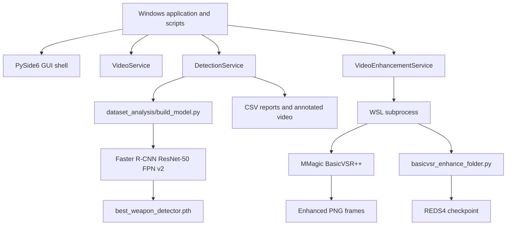

# AI Handoff Context

**Repository:** `cctv-weapon-detection-system`  
**Last updated:** 2026-08-22  
**Working environment:** Windows host with a WSL-based MMagic/BasicVSR++ environment  
**Current thesis phase:** Chapter 4 analysis, validation, and thesis writing

This document is an operational briefing for a future GPT or Copilot session. It records the current implementation, measured results, important paths, and unfinished work so development can continue without reconstructing the project history.

## 1. Thesis Overview

### Working thesis title

**CCTV-Based Weapon Detection System Using Faster R-CNN and BasicVSR++ Video Enhancement**

### Objectives

1. Detect handgun and knife objects in CCTV-style images and videos.
2. Train and use a Faster R-CNN object detector with handgun and knife classes.
3. Investigate whether BasicVSR++ frame enhancement improves downstream weapon detection.
4. Produce time-indexed detection records, annotated frames, annotated videos, and CSV reports.
5. Measure the processing cost of enhancement and detection for deployment-oriented discussion.

### Scope

- Input is prerecorded video or still-image/frame data; the current system is not connected to a live camera stream.
- The detector targets two weapon classes: `handgun` and `knife`.
- The Windows application uses PyTorch/torchvision Faster R-CNN and OpenCV.
- BasicVSR++ runs externally through MMagic in WSL and is used as an optional preprocessing stage.
- Dataset preparation is based on Open Images-style annotations and external JPEG data.
- The current evaluation emphasizes detection counts, average confidence, manual frame review, and processing time. It does not yet provide a complete precision/recall/mAP evaluation.

## 2. Current Architecture



### Windows side

| Component | Location | Current responsibility/status |
|---|---|---|
| Faster R-CNN | `dataset_analysis/build_model.py`, used by `DetectionService` | Constructs torchvision Faster R-CNN ResNet-50 FPN v2 and replaces its predictor for three classes. |
| GUI | `app/main.py`, `app/ui/main_window.py` | Builds a PySide6 desktop window with video controls, metadata fields, progress bar, results table, and export button. Controls are currently not wired to services. |
| `DetectionService` | `app/services/detection_service.py` | Implemented inference, annotation, video processing, frame-directory processing, and CSV writing. |
| `ReportService` | `app/services/report_service.py` | Planned abstraction; file is empty. CSV writing remains inside `DetectionService`. |
| `VideoService` | `app/services/video_service.py` | Implemented OpenCV validation, metadata extraction, frame extraction, and video reconstruction. |
| `VideoEnhancementService` | `app/services/video_enhancement_service.py` | Implemented orchestration around frame extraction, WSL BasicVSR++ execution, and video reconstruction. |

### WSL side

| Component | Expected location | Responsibility |
|---|---|---|
| MMagic project | `/home/pc/thesis/mmagic` | External super-resolution framework and BasicVSR++ runtime. |
| BasicVSR++ runner | `/home/pc/thesis/mmagic/basicvsr_enhance_folder.py` | Reads an input frame directory and writes enhanced PNG frames. |
| MMagic environment | `/home/pc/thesis/mmagic_env/bin/python` | Python interpreter used by the Windows subprocess call. |
| REDS4 checkpoint | External MMagic/WSL environment | Enhancement model checkpoint; separate from the weapon detector checkpoint. |

The Windows repository is mounted in WSL at:

```text
/mnt/c/Users/pc/Documents/THESIS 1/cctv-weapon-detection-system
```

The integration currently hard-codes this user and directory. Porting the project requires changing the paths in `app/services/video_enhancement_service.py`.

## 3. Current Pipeline

```text
Video
	|
	v
Extract Frames
	|
	v
BasicVSR++ in WSL
	|
	v
Enhanced Frames
	|
	v
Faster R-CNN
	|
	+--> CSV Reports
	|
	+--> Annotated Frames
					|
					v
			Annotated Video
```

### Direct detection path

`DetectionService.process_video` opens the source with OpenCV, calculates a frame interval from `analysis_fps`, runs detection on selected frames, draws boxes on those frames, overlays frame/time text on every output frame, writes an `mp4v` MP4, and writes `outputs/reports/<input-stem>_detections.csv`.

### Enhanced comparison path

`VideoService.extract_frames` writes numbered PNGs. `VideoEnhancementService.run_basicvsrpp` clears old outputs and invokes WSL. `DetectionService.detect_frames` is then run independently on the original and enhanced directories. Enhanced frames can be annotated and reconstructed with the original video FPS.

## 4. Implemented Components

### Runtime services

- **VideoService:** validates a video, reads FPS/resolution/frame count/duration, extracts every frame as `frame_000000.png`, and rebuilds MP4 video from sorted PNGs.
- **VideoEnhancementService:** checks WSL access, translates Windows paths to WSL mount paths, runs the external BasicVSR++ folder script, and coordinates extraction/enhancement/reconstruction.
- **DetectionService:** loads `best_weapon_detector.pth`, selects CUDA when available, filters predictions by confidence and target class, detects individual frames or frame directories, draws red bounding boxes, processes sampled video frames, and writes CSV output.
- **Model factory:** `dataset_analysis/build_model.py` creates Faster R-CNN with `num_classes=3`: background, handgun, and knife.

### Completed workflows

- OpenCV video metadata and frame extraction.
- Original-versus-enhanced frame generation.
- BasicVSR++ invocation through WSL/MMagic.
- Handgun and knife inference on still images, PNG directories, and videos.
- Bounding-box annotation and annotated-video reconstruction.
- Detection CSV and benchmark CSV generation.
- Open Images annotation loading and normalized-box conversion through `WeaponDataset`.
- Deterministic 70/15/15 dataset split generation with seed 42.
- Basic Faster R-CNN training loop using SGD for 10 epochs.
- Manual detection smoke tests, enhancement tests, WSL checks, integration scripts, and performance benchmarking.

### Important incomplete components

- `ReportService` is empty; report writing is duplicated in `DetectionService`.
- The GUI has no signal handlers. Video selection, analysis, table population, progress updates, and CSV export do not work through the GUI yet.
- `app/utils/file_validation.py` and `app/utils/timestamps.py` are empty.
- `training/config.py`, `training/dataset.py`, `training/train.py`, and `training/evaluate.py` are empty planned modules. The active training path remains under `dataset_analysis/`.
- The test files are executable scripts with print statements, not assertion-based automated tests.

## 5. Benchmark Results

The recorded benchmark processed **145 frames**.

| Stage | Time |
|---|---:|
| BasicVSR++ enhancement | 185.33 s |
| Faster R-CNN detection | 29.72 s |
| Total pipeline | 215.04 s |
| Total per frame | 1.4831 s/frame |

| Projected video duration | Projected processing time |
|---|---:|
| 1 minute | 37.08 minutes |
| 5 minutes | 185.38 minutes |
| 10 minutes | 370.76 minutes |

The benchmark script is `tests/performance/benchmark_pipeline.py`. It separately times `VideoEnhancementService.run_basicvsrpp` and `DetectionService.detect_frames`, writes metrics to `outputs/reports/benchmark_results.csv`, and projects at 25 FPS. The benchmark is processing-time measurement, not an accuracy benchmark.

## 6. Experimental Results

### Handgun experiment

| Condition | Detections | Average confidence |
|---|---:|---:|
| Original | 147 | 0.6093 |
| Enhanced | 157 | 0.6199 |
| Improvement | +10 | +6.80% |

The enhanced sequence produced 10 more detections. Average confidence increased by 0.0106.

### Knife experiment

| Condition | Detections | Average confidence |
|---|---:|---:|
| Original | 23 | 0.6106 |
| Enhanced | 28 | 0.6230 |
| Improvement | +5 | +21.74% |

The enhanced sequence produced five more detections. Average confidence increased by 0.0124. The larger percentage is partly explained by the smaller original baseline.

### Manual validation

| Frame | Observation | Classification |
|---|---|---|
| Frame 11 | Knife detected; bounding box overlaps arm region | Questionable |
| Frame 12 | Knife detected; bounding box overlaps arm region | Questionable |
| Frame 62 | New valid knife detection | Valid new detection |
| Frame 63 | New valid knife detection | Valid new detection |
| Frame 66 | Detector bounded a person region | False positive |

These observations qualify the positive aggregate results: enhanced frames added useful detections in frames 62 and 63, but also contained ambiguous detections and a confirmed false positive.

The full thesis-style discussion and screenshot placeholders are in `docs/CHAPTER4_EXPERIMENT_LOG.md`.

## 7. Current Thesis Status

### Implemented

- `VideoService`
- `VideoEnhancementService`
- `DetectionService`
- BasicVSR++ integration
- WSL integration
- Faster R-CNN model loading and inference
- Basic dataset preparation and training path
- Benchmarking
- Original/enhanced handgun and knife experiments
- Manual frame validation

### Current phase

- Chapter 4 analysis
- Validation of new and false-positive detections
- Preparation of results tables and graphs
- Thesis writing

### Evidence and artifact locations

| Artifact | Location |
|---|---|
| Trained detector checkpoint | `best_weapon_detector.pth` |
| Source sample videos/images | `samples/` |
| Original frames | `outputs/frames/`, `outputs/knife_original_frames/` |
| Enhanced frames | `outputs/frames_enhanced/`, `outputs/knife_enhanced_frames/`, `outputs/benchmark_enhanced_frames/` |
| Annotated frames | `outputs/frames_annotated/`, `outputs/knife_annotated_frames/` |
| Detection and experiment reports | `outputs/reports/` |
| Chapter 4 log | `docs/CHAPTER4_EXPERIMENT_LOG.md` |
| Repository architecture analysis | `docs/REPOSITORY_ANALYSIS.md` |

## 8. Next Priority Tasks

1. Analyze additional detections, especially newly detected frames and person-region false positives.
2. Produce final Chapter 4 tables from the recorded results.
3. Create graphs for detection counts, confidence changes, and processing-time costs.
4. Prepare defense slides showing the pipeline, original/enhanced comparisons, and manual validation examples.
5. Complete `ReportService` if report generation is required as a separate application responsibility.

### Recommended engineering follow-up

- Wire the GUI controls to services using a background worker so inference does not block the Qt event loop.
- Add ground-truth evaluation with precision, recall, F1-score, and localization metrics.
- Add assertion-based tests for metadata, frame counts, output existence, CSV schemas, and WSL failure handling.
- Replace hard-coded Windows/WSL paths with configuration.
- Validate that BasicVSR++ produces the expected number and ordering of output frames.
- Add validation loss, evaluation metrics, checkpoint metadata, and reproducible configuration to training.

## 9. Quick Commands for a Future Session

Use the repository virtual environment because the system Python may not have the required packages:

```powershell
.venv\Scripts\python.exe -m app.main
```

Run the direct detector demonstration:

```powershell
.venv\Scripts\python.exe -m app.services.detection_service
```

Check WSL and run the enhancement sequence:

```powershell
.venv\Scripts\python.exe tests/integration/test_wsl_connection.py
.venv\Scripts\python.exe tests/enhancement/test_extract_frames.py
.venv\Scripts\python.exe tests/enhancement/test_real_enhancement.py
```

For a future AI assistant, inspect `app/services/detection_service.py` first when changing inference or report output, `app/services/video_enhancement_service.py` for WSL/BasicVSR++ behavior, and `docs/CHAPTER4_EXPERIMENT_LOG.md` for thesis results and wording.

