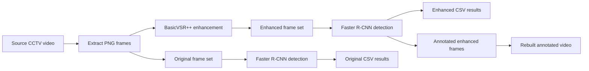

# Chapter 4: Experimental Results and Analysis

This chapter records the completed experiments for the CCTV weapon detection system. The experiments evaluate whether BasicVSR++ frame enhancement improves downstream handgun and knife detection using the trained Faster R-CNN detector.

The reported detection counts and confidence values are aggregate experiment results. A detection is counted when the detector returns a handgun or knife prediction above the configured confidence threshold. Confidence values are reported as the arithmetic mean of the returned detection confidences.

## 4.1 Experimental Objective

The experiment compares two conditions:

- **Original:** detection performed on frames extracted directly from the source video.
- **Enhanced:** the same video frames processed by BasicVSR++ before detection.

The comparison focuses on the number of detections and mean confidence. Additional manual validation examines representative frames to identify whether newly detected regions correspond to weapons or to false positives.

## 4.2 Experimental Pipeline



The implementation uses `VideoService` for frame extraction and reconstruction, `VideoEnhancementService` for the WSL BasicVSR++ call, and `DetectionService` for inference and CSV generation. The detector uses the trained three-class Faster R-CNN model: background, handgun, and knife.

## 4.3 BasicVSR++ Integration

### 4.3.1 MMagic setup

BasicVSR++ was executed through an external MMagic checkout rather than implemented in the Windows application. The WSL-side project location used by the integration is:

```text
/home/pc/thesis/mmagic
```

The enhancement script expected by the application is:

```text
/home/pc/thesis/mmagic/basicvsr_enhance_folder.py
```

The WSL Python environment is:

```text
/home/pc/thesis/mmagic_env/bin/python
```

The environment must contain the MMagic dependencies, the BasicVSR++ configuration/runtime requirements, and the model checkpoint required by the enhancement script.

### 4.3.2 WSL setup

The Windows application invokes WSL with `subprocess.run`. Repository directories are exposed to WSL through the Windows mount under `/mnt/c`.

```text
Windows repository:
C:\Users\pc\Documents\THESIS 1\cctv-weapon-detection-system

WSL repository mount:
/mnt/c/Users/pc/Documents/THESIS 1/cctv-weapon-detection-system
```

Connectivity is checked by executing:

```text
wsl bash -c "echo BasicVSR_OK"
```

The integration considers WSL available when the command exits successfully and the output contains `BasicVSR_OK`.

### 4.3.3 REDS4 checkpoint

The enhancement experiment used the REDS4 checkpoint associated with the BasicVSR++ setup. The checkpoint is part of the external MMagic/WSL environment and is not loaded by the Windows `DetectionService`. This distinction is important:

- the REDS4 checkpoint is used for video-frame enhancement;
- `best_weapon_detector.pth` is used for handgun/knife detection;
- the two checkpoints serve different models and stages.

**Screenshot placeholder:** REDS4 checkpoint and MMagic model/configuration setup.

``

### 4.3.4 Enhancement workflow

The completed enhancement workflow was:

1. Open the source video and read its metadata, including FPS.
2. Extract every source frame as a numbered PNG under an original-frame directory.
3. Clear stale PNG files from the enhancement output directory.
4. Convert Windows paths to WSL mount paths.
5. Run `basicvsr_enhance_folder.py` in the MMagic virtual environment.
6. Read the enhanced PNG frames from the Windows-mounted output directory.
7. Run Faster R-CNN independently on original and enhanced frame sets.
8. Annotate the enhanced detections with bounding boxes and labels.
9. Rebuild the annotated enhanced frames into an MP4 using the source FPS.
10. Save CSV reports for quantitative comparison.

```text
Source video
	-> original PNG frames
	-> BasicVSR++ in WSL
	-> enhanced PNG frames
	-> Faster R-CNN
	-> detection CSV + annotated frames
	-> reconstructed annotated video
```

**Screenshot placeholder:** original frame beside its BasicVSR++ enhanced frame.

``

### 4.3.5 Optimization history

The integration was refined in the following stages:

| Stage | Implementation decision | Experimental purpose |
|---|---|---|
| Initial video handling | Decode video with OpenCV and write numbered PNG frames | Establish a reproducible frame-level input for enhancement and detection. |
| External enhancement integration | Invoke MMagic BasicVSR++ through WSL | Reuse the established BasicVSR++ environment while keeping the application in Windows Python. |
| Output isolation | Clear old enhanced and annotated PNG files before writing new results | Prevent stale frames from contaminating comparisons. |
| Frame-directory detection | Add detection over sorted PNG directories | Permit direct original-versus-enhanced comparison without re-encoding between stages. |
| Annotation and reconstruction | Draw detections on enhanced frames and rebuild an MP4 | Produce visually inspectable evidence in addition to CSV results. |
| Performance-oriented processing | Support configurable analysis FPS for full-video detection and benchmark enhancement/detection separately | Control inference cost and measure the contribution of each processing stage. |

The repository records the optimization mechanism and pipeline structure, but does not contain a complete numeric timing history for every iteration. Consequently, this log reports detection outcomes and qualitative validation rather than claiming unrecorded speedup values.

## 4.4 Handgun Experiment

### 4.4.1 Quantitative results

| Condition | Detections | Average confidence |
|---|---:|---:|
| Original | 147 | 0.6093 |
| Enhanced | 157 | 0.6199 |
| Change | **+10** | **+0.0106** |

The enhanced input produced 10 additional detections. Relative to the original count, this is:

$$
\frac{157 - 147}{147} \times 100 = 6.80\%
$$

The requested experiment result is therefore **+10 detections (+6.80%)**. Mean confidence increased from 0.6093 to 0.6199, an absolute increase of 0.0106.

### 4.4.2 Interpretation

BasicVSR++ produced a positive change for the handgun experiment under the recorded measurement. Both the number of returned detections and the mean confidence increased after enhancement. The result indicates that the enhanced frames exposed or strengthened visual evidence that the detector could use, but detection count alone does not establish that every additional detection was correct. Precision and frame-level ground-truth matching would be required for a formal accuracy claim.

**Screenshot placeholder:** handgun original and enhanced detection output.

``

## 4.5 Knife Experiment

### 4.5.1 Quantitative results

| Condition | Detections | Average confidence |
|---|---:|---:|
| Original | 23 | 0.6106 |
| Enhanced | 28 | 0.6230 |
| Change | **+5** | **+0.0124** |

The enhanced input produced five additional detections. Relative to the original count, this is:

$$
\frac{28 - 23}{23} \times 100 = 21.74\%
$$

The requested experiment result is therefore **+5 detections (+21.74%)**. Mean confidence increased from 0.6106 to 0.6230, an absolute increase of 0.0124.

### 4.5.2 Interpretation

The knife experiment showed a larger relative detection-count improvement than the handgun experiment because the original count was smaller. The enhanced result is encouraging, but the small baseline means that one or two detections have a substantial effect on the percentage. Manual review is therefore necessary to determine whether the newly returned detections represent knives, partially visible knives, or background regions.

**Screenshot placeholder:** knife original and enhanced detection output.

``

## 4.6 Comparative Results

| Experiment | Original detections | Enhanced detections | Detection change | Relative improvement | Original mean confidence | Enhanced mean confidence |
|---|---:|---:|---:|---:|---:|---:|
| Handgun | 147 | 157 | +10 | +6.80% | 0.6093 | 0.6199 |
| Knife | 23 | 28 | +5 | +21.74% | 0.6106 | 0.6230 |

| Experiment | Absolute confidence change | Relative confidence change |
|---|---:|---:|
| Handgun | +0.0106 | approximately +1.74% |
| Knife | +0.0124 | approximately +2.03% |

The results show the same direction of change for both object categories: enhancement increased both detection count and average confidence. The knife result has the larger relative count improvement, while the handgun experiment has the larger absolute increase in detections.

## 4.7 Manual Validation

Manual validation was performed on selected enhanced frames to examine the quality of detections and the new detections introduced by enhancement.

### 4.7.1 Frame-level observations

| Frame | Detector observation | Bounding-box observation | Manual classification |
|---|---|---|---|
| Frame 11 | Knife detected | Bounding box overlaps the arm region | Questionable |
| Frame 12 | Knife detected | Bounding box overlaps the arm region | Questionable |
| Frame 62 | New knife detection | Detection corresponds to a newly visible/identified knife region | Valid new detection |
| Frame 63 | New knife detection | Detection corresponds to a newly visible/identified knife region | Valid new detection |
| Frame 66 | Detection returned | Bounding box covers a person region rather than a knife | False positive |

### 4.7.2 Validation summary

| Validation category | Frames | Count |
|---|---|---:|
| Questionable detections | 11, 12 | 2 |
| Valid new knife detections | 62, 63 | 2 |
| False positive | 66 | 1 |

The observations show that the increase in aggregate detections is mixed: frames 62 and 63 provide evidence of useful new detections, while frame 66 demonstrates that enhancement can also preserve or amplify a detector error. Frames 11 and 12 remain uncertain because the overlapping arm region makes it difficult to determine whether the predicted box is localized to the knife.

**Screenshot placeholder:** manual validation frames 11 and 12.

``

**Screenshot placeholder:** manual validation frames 62 and 63.

``

**Screenshot placeholder:** false positive in frame 66.

``

## 4.8 Discussion

The experiments provide evidence that BasicVSR++ enhancement can improve the downstream detector's response on the evaluated videos. The handgun sequence gained 10 detections, equivalent to 6.80% relative improvement, and its mean confidence increased by 0.0106. The knife sequence gained five detections, equivalent to 21.74% relative improvement, and its mean confidence increased by 0.0124.

The manual results add an important qualification. Two new knife detections, in frames 62 and 63, were judged valid. In contrast, frames 11 and 12 were questionable because the predicted regions overlapped an arm, and frame 66 was a false positive covering a person region. Therefore, the increase in detection count should be interpreted as improved detector sensitivity on these samples, not as a direct increase in accuracy.

The comparison is also sensitive to the detector threshold, the number and duration of evaluated videos, the scene content, and whether the original and enhanced frames are perfectly aligned. A stronger evaluation would associate detections with frame-level ground truth and report precision, recall, F1-score, and localization metrics in addition to counts and mean confidence.

## 4.9 Limitations

1. The reported comparison is based on aggregate detection counts and average confidence, not a complete ground-truth evaluation.
2. The evaluated sample is limited; results may not generalize to different cameras, lighting conditions, viewpoints, compression levels, or weapon sizes.
3. BasicVSR++ enhancement can introduce visual artifacts or sharpen background structures that resemble weapon features.
4. Manual validation identified questionable detections and a false positive, so increased detections are not necessarily all true positives.
5. The relative knife improvement is strongly affected by the small original baseline of 23 detections.
6. The Windows-to-WSL integration uses fixed paths and an external MMagic environment, which reduces reproducibility on other machines.
7. The current pipeline does not track an object across frames. A detection appearing in multiple frames is counted multiple times.
8. In full-video processing, inference is sampled at a configurable analysis FPS rather than necessarily running on every frame.
9. The experiment log does not contain a complete timing table for each optimization iteration, so processing-speed conclusions should not be inferred from this chapter.

## 4.10 Conclusions

BasicVSR++ integration was completed through MMagic and WSL, using the REDS4 enhancement checkpoint in the external enhancement environment. The resulting enhanced frames were successfully passed to the Faster R-CNN handgun/knife detector and compared with detections from the original frames.

For the recorded experiments, enhancement increased handgun detections from 147 to 157 (+10, +6.80%) and knife detections from 23 to 28 (+5, +21.74%). Average confidence also increased in both experiments. Manual validation confirmed two useful new knife detections, while also identifying two questionable detections and one false positive. The overall conclusion is that BasicVSR++ is a promising preprocessing step for this system, but its benefit should be stated as improved observed sensitivity on the evaluated samples rather than proven accuracy improvement until a larger ground-truth-based evaluation is completed.

