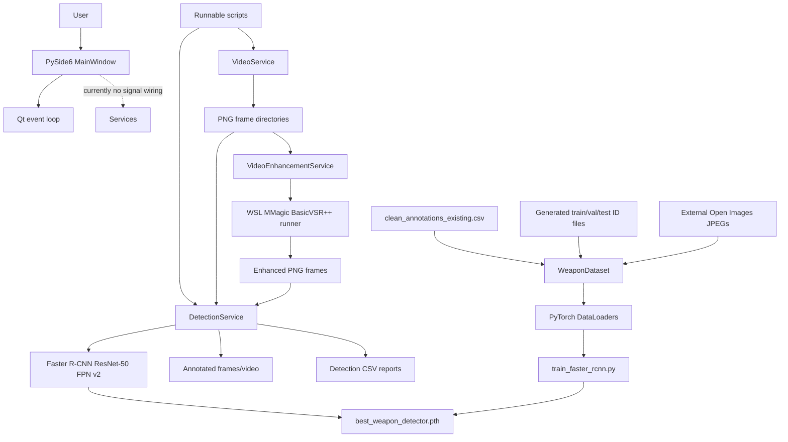
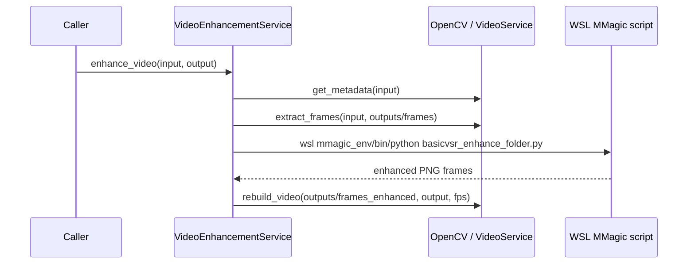
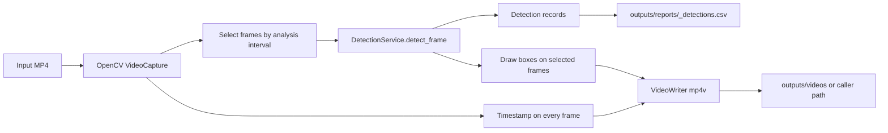

# CCTV Weapon Detection System

## Repository Analysis

**Snapshot:** 2026-08-22  
**Purpose:** CCTV video processing, handgun/knife object detection, optional BasicVSR++ frame enhancement, and dataset/training experimentation.

This document describes the repository as it exists now. It distinguishes executable code from planned or empty modules. The main usable path is script-driven; the PySide6 interface currently constructs controls but does not connect them to the services.

## 1. Architecture Overview

The repository has four practical layers:

1. **Desktop shell:** `app/main.py` starts a PySide6 window defined in `app/ui/main_window.py`.
2. **Runtime services:** `VideoService` performs OpenCV video I/O, `VideoEnhancementService` invokes an external BasicVSR++ process through WSL, and `DetectionService` loads the trained Faster R-CNN checkpoint and produces detections, annotations, videos, and CSV reports.
3. **Model and data tooling:** `dataset_analysis/` contains the active dataset adapter, model factory, split generator, DataLoaders, training script, dataset-download tools, and review tooling.
4. **Experiments and fixtures:** `tests/` contains runnable smoke, integration, enhancement, detection, and benchmark scripts. `samples/`, `review_batch/`, `removed_images/`, and `outputs/` contain input and generated artifacts.



### Dependency boundaries

- Runtime inference depends on `best_weapon_detector.pth`, PyTorch/torchvision, and OpenCV.
- Model construction is shared by training and inference through `dataset_analysis/build_model.py`.
- Training data images are not stored in the repository. `create_dataloaders.py` currently expects `C:\Users\pc\fiftyone\open-images-v6\train\data`.
- BasicVSR++ is not implemented inside this repository. WSL must have `/home/pc/thesis/mmagic`, `/home/pc/thesis/mmagic_env/bin/python`, and `basicvsr_enhance_folder.py`.
- Most paths are relative to the current working directory, so commands should normally be run from the repository root. The training imports also make running from `dataset_analysis/` the safer option unless `PYTHONPATH` is configured.

## 2. Folder Structure

```text
cctv-weapon-detection-system/
|-- app/
|   |-- main.py
|   |-- services/
|   |   |-- detection_service.py
|   |   |-- report_service.py
|   |   |-- video_enhancement_service.py
|   |   |-- video_service.py
|   |-- ui/
|   |   |-- main_window.py
|   |   |-- styles.qss
|   |-- utils/
|       |-- file_validation.py
|       |-- timestamps.py
|-- dataset_analysis/
|   |-- build_model.py
|   |-- weapon_dataset.py
|   |-- create_dataset_splits.py
|   |-- create_dataloaders.py
|   |-- train_faster_rcnn.py
|   |-- test_dataset.py
|   |-- tools/                 # Open Images downloads and Gemini review
|   |-- *.csv, *.txt, *.md     # annotations, IDs, and curation records
|-- training/                  # intended package; currently empty except __init__.py
|-- tests/
|   |-- detection/
|   |-- enhancement/
|   |-- integration/
|   |-- performance/
|   |-- experimental/
|   |-- services/
|-- samples/                   # test images and videos
|-- review_batch/              # reviewer-specific image batches
|-- removed_images/            # quarantined images
|-- outputs/                   # frames, reports, videos, and benchmark artifacts
|-- data/                      # README marker; dataset is external/ignored
|-- archive/                   # historical requirements file
|-- utils3/                    # present in the workspace tree; no active source observed
|-- best_weapon_detector.pth   # trained state dictionary
|-- requirements.txt
|-- README.md
```

### Folder purposes

| Folder | Purpose and current state |
|---|---|
| `app/` | Desktop application package and runtime service layer. |
| `app/services/` | Actual video, enhancement, and detection implementations. Report service is empty. |
| `app/ui/` | PySide6 window layout and an empty, unused QSS stylesheet. |
| `app/utils/` | Reserved utility modules; both current files are empty. |
| `dataset_analysis/` | Active training/data-preparation implementation and historical analysis artifacts. |
| `dataset_analysis/tools/` | FiftyOne download/count scripts and Gemini-based review script. |
| `training/` | Planned refactor of training code; `config.py`, `dataset.py`, `train.py`, and `evaluate.py` are empty. |
| `tests/` | Runnable scripts, not a conventional automated test suite. |
| `samples/` | Handgun, knife, negative, and evaluation video/image fixtures. |
| `review_batch/` | Downloaded reviewer batches for manual or Gemini-assisted dataset review. |
| `removed_images/` | Quarantined handgun and knife images excluded during curation. |
| `outputs/` | Generated PNG frames, annotated frames, videos, and CSV reports. |
| `data/` | Placeholder directory; actual training images are external. |
| `archive/` | Historical dependency snapshot. |

## 3. Major Python Files

### Application entry point and UI

- `app/main.py`: creates `QApplication`, instantiates `MainWindow`, shows it, and enters `application.exec()`.
- `app/ui/main_window.py`: builds the window, camera ID input, video selection button, metadata labels, analyze button, progress bar, results table, export button, and status label. It has no signal/slot connections and does not import any service.
- `app/ui/styles.qss`: empty; it is not loaded by `app/main.py` or `MainWindow`.

### Runtime services

- `app/services/video_service.py`: OpenCV validation, metadata, frame extraction, and video reconstruction.
- `app/services/video_enhancement_service.py`: coordinates frame extraction, external BasicVSR++ execution, and reconstruction; also checks WSL availability.
- `app/services/detection_service.py`: model loading, single-frame inference, directory inference, annotation, video inference, and CSV writing.
- `app/services/report_service.py`: empty placeholder. CSV writing currently lives in `DetectionService`.

### Model and training files

- `dataset_analysis/build_model.py`: returns torchvision Faster R-CNN ResNet-50 FPN v2 with a three-class predictor.
- `dataset_analysis/weapon_dataset.py`: PyTorch `Dataset` for Open Images-style normalized bounding-box annotations.
- `dataset_analysis/create_dataset_splits.py`: deterministic 70/15/15 image-ID split with seed 42.
- `dataset_analysis/create_dataloaders.py`: creates train, validation, and test datasets/loaders with a detection-specific collate function.
- `dataset_analysis/train_faster_rcnn.py`: ten-epoch SGD training loop and lowest training-loss checkpoint save.
- `dataset_analysis/test_dataset.py`: prints a sample image/target structure.
- `training/config.py`, `training/dataset.py`, `training/train.py`, `training/evaluate.py`: empty planned package modules.

### Dataset tooling

`dataset_analysis/tools/count_available_images.py` and `count_available_images_handgun.py` inspect Open Images availability through FiftyOne. `download_weapon_samples.py`, `download_reviewer_b.py`, `download_reviewer_c.py`, `download_reviewer_d.py`, and `download_full_weapon_dataset.py` download class-specific Open Images subsets. `gemini_dataset_checker.py` sends review images to Gemini, parses category/status/reason fields, and writes review and invalid-ID CSV files. The checker currently processes only the first image because `audit_folder` uses `collect_images(folder_path)[:1]`.

## 4. Service Classes and Responsibilities

### `VideoService`

`VideoService` owns basic OpenCV media operations:

- `validate_video(video_path)`: confirms the file exists and OpenCV can open it.
- `get_metadata(video_path)`: returns `fps`, `width`, `height`, `total_frames`, and `duration_seconds`.
- `extract_frames(video_path, output_dir)`: writes every decoded frame as `frame_000000.png`, `frame_000001.png`, and so on.
- `rebuild_video(frames_directory, output_video_path, fps)`: sorts PNGs, uses the first frame dimensions, writes an `mp4v` video, and preserves the supplied FPS.

### `VideoEnhancementService`

This class composes `VideoService` with a subprocess call:

- `enhance_video(input_video_path, output_video_path)`: extracts all frames into `outputs/frames`, runs BasicVSR++ into `outputs/frames_enhanced`, and rebuilds the output video using source FPS.
- `run_basicvsrpp(input_frames_dir, output_frames_dir)`: clears existing output PNGs, converts repository-relative paths to hard-coded WSL `/mnt/c/...` paths, and runs the external MMagic Python script. Non-zero exit status raises `RuntimeError`.
- `verify_wsl_access()`: runs `wsl bash -c "echo BasicVSR_OK"` and returns a Boolean.

The service does not validate that the enhanced frame count matches the input count, does not pass model parameters, and assumes the Windows user/path and WSL installation shown in the source.

### `DetectionService`

The detector loads the checkpoint once per instance. It selects CUDA when available, otherwise CPU, constructs `get_model(num_classes=3)`, loads `best_weapon_detector.pth`, moves the model to the device, and switches it to evaluation mode. Class IDs are `1 = handgun` and `2 = knife`; background is the third model class and unknown labels are discarded.

- `detect_frame(frame)`: converts BGR to RGB, creates a normalized CHW tensor, runs inference, applies the configured confidence threshold, filters to handgun/knife, and returns dictionaries containing `class_id`, `class_name`, `confidence`, and `[x1, y1, x2, y2]`.
- `detect_frames(frames_directory, csv_output_path=None)`: runs inference over sorted PNGs and optionally writes `frame_name`, `class_name`, `confidence`, `x1`, `y1`, `x2`, `y2`.
- `detect_and_annotate_frames(...)`: clears the annotation directory, detects every PNG, draws red boxes/labels, writes annotated PNGs, and optionally writes the same directory-level CSV schema.
- `process_video(input_path, output_path, confidence_threshold=0.50, analysis_fps=5)`: reads every source frame, runs inference only at an interval approximating `analysis_fps`, draws detections on analyzed frames, overlays frame/time on all output frames, writes an MP4, and writes `outputs/reports/<input-stem>_detections.csv`.
- `test_first_frame(video_path)`: seeks to the middle frame and prints detections; it is a manual diagnostic.
- `scan_video_for_weapons(video_path)`: samples approximately five frames per second and prints detections without producing a report.
- `scan_video_for_knives(video_path)`: backward-compatible alias for the weapon scan.

`draw_detections(frame, detections)` is a module-level helper that mutates the frame in place using red OpenCV BGR boxes and white labels.

## 5. Detection Workflow

```text
Input video or PNG directory
	|
	v
OpenCV decode / cv2.imread
	|
	v
BGR -> RGB -> float tensor / 255 -> CHW
	|
	v
Faster R-CNN ResNet-50 FPN v2
	|
	v
Confidence filter (threshold) + class filter (handgun, knife)
	|
	+--> detection dictionaries / CSV records
	|
	+--> red bounding boxes and labels
	|
	+--> annotated PNGs or annotated MP4
```

For full-video processing, all frames are copied into the output video, but only frames whose number is divisible by `max(1, round(source_fps / analysis_fps))` receive model inference. This means an output frame between analysis points has only its timestamp overlay and does not inherit a previous detection box. The CSV contains only analyzed frames with detections.

The default module demonstration processes `samples/handgun_test-video.mp4` to `outputs/videos/handgun_detected_short-video.mp4` at threshold `0.70` and approximately 15 analyzed frames per second.

## 6. BasicVSR++ Workflow

BasicVSR++ is an external enhancement stage, not a local Python dependency or model implementation.



The exact subprocess uses:

```text
wsl /home/pc/thesis/mmagic_env/bin/python \
    /home/pc/thesis/mmagic/basicvsr_enhance_folder.py \
    /mnt/c/Users/pc/Documents/THESIS 1/cctv-weapon-detection-system/outputs/frames \
    /mnt/c/Users/pc/Documents/THESIS 1/cctv-weapon-detection-system/outputs/frames_enhanced
```

Before using it, verify WSL with `VideoEnhancementService().verify_wsl_access()`. The integration assumes the external script accepts input and output frame directories and writes PNGs. `tests/enhancement/test_real_enhancement.py` and the integration scripts exercise this boundary but require the external environment and can be expensive.

## 7. WSL Integration Workflow

1. Windows Python calls `subprocess.run(["wsl", ...])`.
2. Windows repository paths are translated manually to `/mnt/c/Users/pc/Documents/THESIS 1/cctv-weapon-detection-system/...`.
3. WSL uses the virtual environment `/home/pc/thesis/mmagic_env/bin/python`.
4. WSL executes `/home/pc/thesis/mmagic/basicvsr_enhance_folder.py`.
5. Output PNGs appear in the Windows-mounted output directory.
6. Windows OpenCV rebuilds those PNGs into an MP4.

There is no configuration object for the Windows path, WSL project path, interpreter, or script. Porting this repository to another Windows account or directory requires editing `video_enhancement_service.py` or adding configuration. WSL failures are surfaced as the subprocess stderr in a `RuntimeError`.

## 8. Training Pipeline

The active trainer is `dataset_analysis/train_faster_rcnn.py`, not `training/train.py`.

```text
clean_annotations_existing.csv
	|
	v
create_dataset_splits.py (unique ImageID; 70/15/15; seed 42)
	|
	+--> dataset_analysis/train_ids.txt
	+--> dataset_analysis/val_ids.txt
	+--> dataset_analysis/test_ids.txt
	|
	v
create_dataloaders.py -> WeaponDataset -> external Open Images JPEGs
	|
	v
get_model(num_classes=3)
	|
	v
10 epochs, SGD(lr=.005, momentum=.9, weight_decay=.0005)
	|
	v
best_weapon_detector.pth (lowest training loss)
```

`WeaponDataset` maps Open Images labels `/m/0gxl3` to handgun ID 1 and `/m/04ctx` or `/m/058qzx` to knife ID 2. Normalized `XMin`, `XMax`, `YMin`, and `YMax` values are multiplied by the loaded image dimensions. The target contains `boxes`, `labels`, and an index-based `image_id`.

The trainer uses torchvision's detection loss dictionary, sums losses, backpropagates, and saves only `model.state_dict()`. It has no validation loss, detection metrics, checkpoint metadata, resume support, command-line arguments, scheduler, or test-set evaluation. The dataset constructor accepts `transforms` but does not apply them. Empty/invalid boxes are not explicitly validated.

The `training/` package appears to be a future canonical location and currently has no implementation. The repository-root checkpoint is consumed by inference and is ignored by the current `.gitignore` pattern for `*.pth`, although it exists in this workspace.

## 9. Dataset Preparation Workflow

The data work is separate from the runtime application:

1. FiftyOne tools download or count Open Images Handgun and Knife samples.
2. Reviewer batches are stored under `review_batch/reviewer_b`, `reviewer_c`, and `reviewer_d`.
3. Images may be reviewed manually or through `dataset_analysis/tools/gemini_dataset_checker.py` using `GEMINI_API_KEY`.
4. The checker writes reviewer CSVs and `invalid_<csv-name>` files. Its current `[:1]` slice means a complete batch audit requires removing or changing that limit.
5. Invalid/quarantined images are represented under `removed_images/` and in ID lists/documentation.
6. `clean_annotations_existing.csv` is the annotation CSV used by the current split generator and loader. `clean_annotations.csv` also exists but is not the active loader input.
7. `create_dataset_splits.py` generates the split ID files required by `create_dataloaders.py`.
8. External Open Images JPEGs must exist at the hard-coded `images_dir` before a dataset sample can load.

The repository includes curation records such as `dataset_cleaning_log.md`, `dataset_cleaning_plan.md`, `final_dataset_inventory.md`, `final_dataset_statistics.md`, reviewer ID files, and review CSVs. These are evidence/history, not runtime dependencies.

## 10. Input Video to Final Report

### Direct detection path



The final direct-processing CSV has columns:

```text
frame_number,timestamp_seconds,class_name,confidence,x1,y1,x2,y2
```

### Enhanced comparison path

The experimental pipeline in `tests/experimental/test_knife_evaluation_experiment.py` extracts original frames, enhances them through WSL, detects both original and enhanced directories, annotates enhanced frames, rebuilds an annotated video, and prints counts/average confidence for comparison. It can produce `evaluation_original.csv`, `evaluation_enhanced.csv`, `evaluation_enhanced_annotated.csv`, and an annotated MP4 when run successfully.

## 11. Tests and Experiment Scripts

These files are executable scripts with top-level code. They are not standard pytest tests: most print results and have no assertions.

| Path | Purpose |
|---|---|
| `tests/detection/test_model.py` | Builds the model and loads the checkpoint to check compatibility. |
| `tests/detection/test_image.py` | Runs one image smoke test; expects `samples/test.jpg`, which is not present in the current sample listing. |
| `tests/detection/test_image_folder.py` | Runs detector over handgun, knife, and negative JPG folders at threshold 0.70. |
| `tests/detection/test_detect_original_frames.py` | Detects `outputs/frames` and writes an original-frame CSV. |
| `tests/detection/test_detect_enhanced_frames.py` | Detects `outputs/frames_enhanced` and writes an enhanced-frame CSV. |
| `tests/detection/test_annotate_enhanced_frames.py` | Annotates enhanced frames, writes a CSV, and rebuilds an annotated video. |
| `tests/services/test_video_service.py` | Prints metadata for a sample video. |
| `tests/enhancement/test_video_enhancement_service.py` | Confirms the enhancement service can be instantiated. |
| `tests/enhancement/test_extract_frames.py` | Extracts a sample video to `outputs/frames`. |
| `tests/enhancement/test_rebuild_video.py` | Rebuilds `outputs/frames` into an MP4. |
| `tests/enhancement/test_real_enhancement.py` | Runs the external BasicVSR++ stage. |
| `tests/integration/test_wsl_connection.py` | Prints the Boolean WSL access check. |
| `tests/integration/test_full_enhancement_pipeline.py` | Runs extraction, enhancement, and reconstruction end to end. |
| `tests/performance/benchmark_pipeline.py` | Times BasicVSR++ and detection per frame, writes benchmark CSV, and projects 1/5/10-minute processing time at 25 FPS. |
| `tests/experimental/test_knife_evaluation_experiment.py` | Compares original/enhanced detection results and produces annotated enhanced output. |

There is no configured automated assertion suite, no visible `pytest` configuration, and no implemented evaluation script in `training/evaluate.py`. Running top-level test files can overwrite output directories and requires model/data/WSL prerequisites depending on the script.

## 12. Outputs and Generated Artifacts

| Location | Artifact |
|---|---|
| `outputs/frames/` | Original video frames from `VideoService.extract_frames`. |
| `outputs/frames_enhanced/` | BasicVSR++ output frames. Existing PNGs are deleted before enhancement. |
| `outputs/frames_annotated/` | Detector-annotated PNG frames. Existing PNGs are deleted before annotation. |
| `outputs/knife_original_frames/` | Original frames used by the knife/evaluation experiment. |
| `outputs/knife_enhanced_frames/` | Enhanced frames used by that experiment. |
| `outputs/knife_annotated_frames/` | Annotated enhanced frames. |
| `outputs/benchmark_enhanced_frames/` | Enhancement output for the benchmark script. |
| `outputs/videos/` | Rebuilt or direct processed MP4 files. |
| `outputs/enhanced_videos/` | Reserved directory; currently empty in the observed workspace. |
| `outputs/reports/` | Detection, comparison, and benchmark CSV files. |
| `best_weapon_detector.pth` | Faster R-CNN state dictionary with background, handgun, and knife classes. |
| `dataset_analysis/train_ids.txt`, `val_ids.txt`, `test_ids.txt` | Generated split IDs; required locally but generated files may not be present in a clean checkout. |
| reviewer-root CSV files | Gemini/manual review results and invalid IDs. |

Detection-directory CSVs use `frame_name`; full-video CSVs use `frame_number` and `timestamp_seconds`. Benchmark CSVs use `metric,value,unit`. These are separate schemas and should not be treated as interchangeable.

## 13. Current Implementation Status

### Working or substantially implemented

- Faster R-CNN model factory and checkpoint-loading inference path.
- Single-frame, frame-directory, and sampled full-video detection.
- Bounding-box annotation and CSV output.
- OpenCV metadata, frame extraction, and video reconstruction.
- BasicVSR++ subprocess orchestration when the required WSL/ MMagic environment exists.
- Dataset split generation, dataset adapter, DataLoaders, and a basic training loop.
- Manual detection, enhancement, integration, and benchmark scripts.
- Sample media and review/quarantine artifacts.

### Partial, fragile, or environment-dependent

- Training requires external Open Images JPEGs and generated split files; paths are hard-coded and training imports are cwd-sensitive.
- Training selects the best checkpoint by training loss only and does not evaluate validation/test quality.
- BasicVSR++ requires a separately maintained WSL checkout and hard-coded Windows path.
- Gemini review requires an API key and currently processes only one image per folder.
- `.gitignore` excludes model/video/report artifacts even though the current workspace contains them.
- Documentation and curation records may describe historical states and should be reconciled with CSV contents before being used as quantitative ground truth.

### Not implemented or not connected

- `report_service.py`, `file_validation.py`, and `timestamps.py` are empty.
- `training/config.py`, `training/dataset.py`, `training/train.py`, and `training/evaluate.py` are empty.
- `styles.qss` is empty and unused.
- The GUI buttons have no handlers: selecting a video, analyzing it, showing results, progress reporting, and exporting a report are not implemented through the window.
- There is no persistent application state, background worker, cancellation path, or error presentation in the GUI.
- There is no automated regression test suite with assertions or CI configuration.

## 14. Practical Run Order

### Inference on a video

From the repository root, ensure the virtual environment and checkpoint are available, then run the module entry point or call `process_video` from a small script. The module demonstration is:

```powershell
.venv\Scripts\python.exe -m app.services.detection_service
```

This writes an annotated MP4 under `outputs/videos/` and a report under `outputs/reports/`.

### Frame enhancement and detection

```powershell
.venv\Scripts\python.exe tests/integration/test_wsl_connection.py
.venv\Scripts\python.exe tests/enhancement/test_extract_frames.py
.venv\Scripts\python.exe tests/enhancement/test_real_enhancement.py
.venv\Scripts\python.exe tests/detection/test_detect_enhanced_frames.py
.venv\Scripts\python.exe tests/detection/test_annotate_enhanced_frames.py
```

### Training

1. Install the Python dependencies and make the external Open Images image directory available.
2. Run `create_dataset_splits.py` to generate the three ID files.
3. Run the active trainer `dataset_analysis/train_faster_rcnn.py` from a context where its local imports resolve.
4. Confirm that `best_weapon_detector.pth` was produced before running inference.

## 15. Onboarding Priorities

For a new developer, the highest-value next work is to wire the GUI to services using a worker thread, move report formatting into `ReportService`, replace hard-coded paths with configuration, add validation and timestamp helpers, and convert the executable scripts into assertion-based tests. Training should gain validation metrics and a reproducible configuration, while the BasicVSR++ boundary should validate output frame count and expose its WSL settings.
